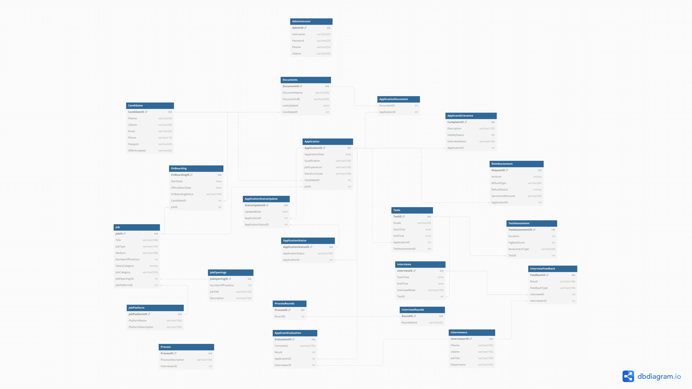
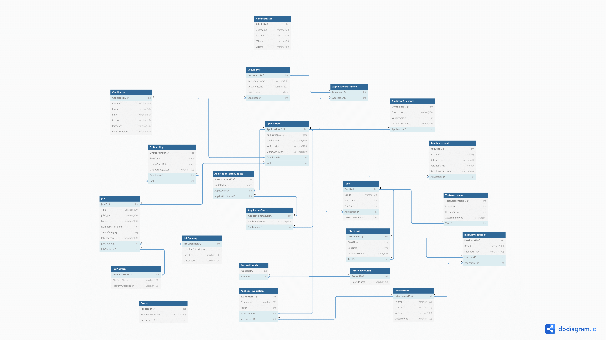

# 🎓 University Recruitment Database

<p align="center">
  
  <br/>
  <em>ER diagram of the recruitment database showing core tables and relationships.</em>
</p>

---

## 📖 Overview
The **University Recruitment Database** project provides SQL schemas, reporting queries, and Jupyter notebooks to explore and visualize insights into university recruitment and student lifecycle management.  

The database supports applications, onboarding, interviews, and course assignments, while the notebook visualizes student and faculty data for analysis.

---

## ✨ Features
- **Entity-Relationship (ER) Diagrams** for understanding database design
- **Student Enrollment Trends** (bar charts)
- **Instructor Salary Distribution** (histograms)
- **Course Enrollment Distribution**
- **Department-wise Instructor Counts**
- **Tuition vs. Course Units Analysis** (scatter plots)
- SQL scripts for schema creation and reporting

---

## 🗂️ Repository Structure
```

University-Recruitment-Database/
│── Notebook.ipynb              # Jupyter notebook for data visualization
│── UMC.sql                     # SQL schema for University Recruitment DB
│── business\_reports.sql        # Reporting queries for insights
│── assets/
│    └── diagram/
│        ├── diagram-1.png      # ER Diagram (main view)
│        ├── diagram-2.png      # ER Diagram (extended view)
│── README.md                   # Project documentation

````

---

## 🖼️ Database Diagrams
### Main ER Diagram
<p align="center">
  
</p>

### Extended ER Diagram
<p align="center">
  
</p>

---

## ⚙️ Prerequisites
- **Python 3.x**
- Jupyter Notebook
- Required libraries:
  ```bash
  pip install pandas numpy matplotlib
````

---

## 🚀 Getting Started

1. Clone the repository:

   ```bash
   git clone https://github.com/lilswapnil/University-Recruitment-Database.git
   cd University-Recruitment-Database
   ```

2. Set up the database:

   * Run `UMC.sql` to create schema
   * Optionally execute `business_reports.sql` for reports

3. Launch notebook:

   ```bash
   jupyter notebook Notebook.ipynb
   ```

4. Execute cells to visualize insights.

---

## 📊 Sample Visualization

```python
import matplotlib.pyplot as plt
import pandas as pd

df = pd.DataFrame({
    "Department": ["CS", "Math", "Physics", "Biology"],
    "Instructors": [12, 8, 10, 6]
})

plt.bar(df["Department"], df["Instructors"], color="teal")
plt.title("Department-wise Instructor Count")
plt.xlabel("Department")
plt.ylabel("Number of Instructors")
plt.show()
```

---

## 👨‍💻 Contributors

* **Scott B.**
* **Shreya Bandodkar**

---

## 📜 License

This project is licensed under the **MIT License**.

```

---
